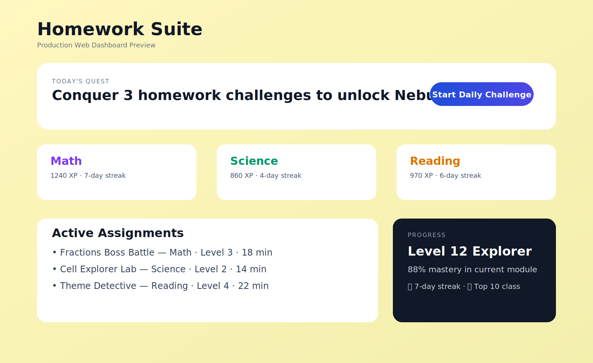
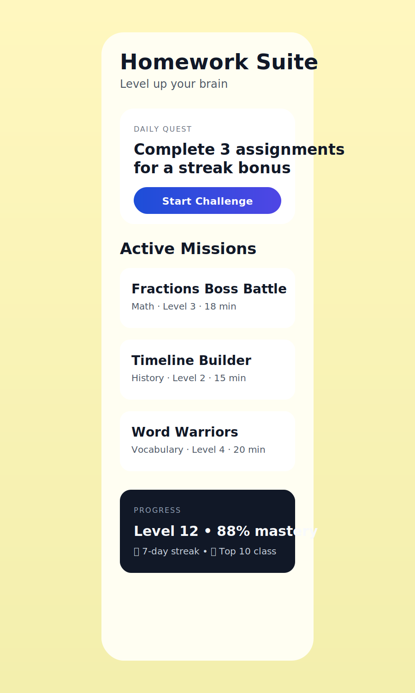

Homework Suite is a cross-platform homework gaming platform for students (ages 6–25+), with companion tools for teachers and parents.

## What is in this repository
This repo includes a multi-app MVP scaffold:

- `apps/web` — Next.js web app inspired by the attached mobile-first UI aesthetic.
- `apps/mobile` — Expo React Native app for iOS + Android.
- `services/api` — Express + TypeScript backend with core MVP endpoints.
- `packages/domain` — Shared domain types for cross-platform consistency.
- `docs/` — Product requirements, architecture, roadmap, and screenshot preview assets.

## MVP Features Implemented
- Student dashboard UI with daily quest, active assignments, and streak/progress cards.
- Mobile dashboard UI following the provided visual direction (soft yellow background, rounded cards, high-contrast CTA).
- Backend endpoints aligned with the requested API skeleton:
  - `POST /api/auth/register`
  - `POST /api/auth/login`
  - `POST /api/homework/upload`
  - `POST /api/homework/parse`
  - `GET /api/games/:homeworkId`
  - `POST /api/games/:gameId/answer`
  - `GET /api/progress/user/:userId`
  - `GET /api/leaderboard/:scope`

## Quick Start
### 1) Install dependencies
```bash
npm install
```

### 2) Run web app
```bash
npm run dev:web
```

### 3) Run API
```bash
npm run dev:api
```

### 4) Run mobile app (Expo)
```bash
npm run dev:mobile
```

## Checks and Tests
- Structural smoke check:
  ```bash
  npm run test:smoke
  ```
- Type checks:
  ```bash
  npm run check
  ```

> Note: in restricted environments where npm registry access is blocked (HTTP 403), dependency installation and framework-level typechecks cannot complete. Use `npm run test:smoke` as a minimal offline verification.

## Production Screenshots
### Web Dashboard


### Mobile Dashboard


## UI Preview Assets
Static preview pages used for screenshot generation are available at:
- `docs/screenshots/web-preview.html`
- `docs/screenshots/mobile-preview.html`
- `docs/screenshots/TROUBLESHOOTING.md`

## Screenshot Capture (Fix for Black Screens)
If screenshot artifacts appear black/blank, follow the troubleshooting checklist:
- `docs/screenshots/TROUBLESHOOTING.md`

Recommended capture flow:
1. `python3 -m http.server 8000`
2. Capture from `http://127.0.0.1:8000/docs/screenshots/web-preview.html` and `.../mobile-preview.html`
3. Wait for selectors before screenshot (`main` / `.phone`)


## Product Direction
See:
- `docs/PRODUCT_REQUIREMENTS.md`
- `docs/ARCHITECTURE.md`
- `docs/ROADMAP.md`

## License
MIT — see [LICENSE](LICENSE).
